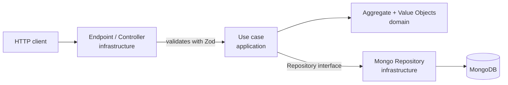

# Rondo API

Backend for the **Rondo** project, a service to create, share and collaborate on football plays.

The API lets users sign up, publish plays (_posts_), save them as _drafts_, comment, propose changes to other users' plays (_proposals_) and mark content as favourite.

## Table of contents

- [Tech stack](#tech-stack)
- [Prerequisites](#prerequisites)
- [Getting started](#getting-started)
  - [Environment variables](#environment-variables)
  - [Running locally](#running-locally)
  - [Running with Docker](#running-with-docker)
- [API documentation](#api-documentation)
- [Testing](#testing)
- [Architecture](#architecture)
  - [Vertical Slicing](#vertical-slicing-organization-by-features)
  - [Hexagonal Architecture](#hexagonal-architecture-organization-by-layers)
  - [Request flow](#request-flow)
  - [Dependency injection](#dependency-injection)
- [Project structure](#project-structure)

## Tech stack

| Area                 | Technology                                                                      |
| -------------------- | ------------------------------------------------------------------------------- |
| Runtime              | [Node.js](https://nodejs.org/) (v22, uses native TypeScript support)            |
| Language             | [TypeScript](https://www.typescriptlang.org/)                                   |
| HTTP framework       | [Hono](https://hono.dev/)                                                       |
| Database             | [MongoDB](https://www.mongodb.com/)                                             |
| Dependency injection | [InversifyJS](https://inversify.io/)                                            |
| Schema validation    | [Zod](https://zod.dev/)                                                         |
| Documentation        | [OpenAPI / Swagger UI](https://swagger.io/) (`hono-openapi`)                    |
| Authentication       | JWT via cookies                                                                 |
| Password hashing     | [bcrypt](https://github.com/kelektiv/node.bcrypt.js)                            |
| Testing              | [Vitest](https://vitest.dev/) + [Supertest](https://github.com/ladjs/supertest) |

## Prerequisites

- **Node.js 22+** (relies on native execution of `.ts` files, no build step).
- **MongoDB** locally or via Docker.
- **Docker + Docker Compose** (optional, to spin up the whole environment).

## Getting started

### Environment variables

Configuration is centralized in [src/config/infrastructure/config.ts](src/config/infrastructure/config.ts) and is fed by environment variables. Each environment loads a different file:

- `npm run dev` → loads `.env.development`
- Docker Compose (`app`) → loads `.env.production`
- Integration tests → load `.env.test`

| Variable         | Description                | Default value               |
| ---------------- | -------------------------- | --------------------------- |
| `PORT`           | Port the API listens on    | `3010`                      |
| `MONGO_URI`      | MongoDB connection URI      | `mongodb://mongo:27017`     |
| `DB_DATABASE`    | Database name              | `dev`                       |
| `TEST_MONGO_URI` | MongoDB URI for tests      | `mongodb://localhost:27017` |
| `TEST_DATABASE`  | Database for tests         | `test`                      |
| `HASH_SALT`      | bcrypt salt rounds         | `10`                        |
| `JWT_SECRET`     | Secret used to sign JWTs   | `secret`                    |

> All routes hang off the base prefix `/api/v1` (defined in `config.app.baseUrl`).

Example `.env.development`:

```env
PORT=3000
MONGO_URI=mongodb://localhost:27017
DB_DATABASE=dev
HASH_SALT=10
JWT_SECRET=a-more-secure-secret
```

### Running locally

```bash
# 1. Install dependencies
npm install

# 2. Start MongoDB (if it isn't already running)
docker compose -f "docker-compose.yml" up -d

# 3. Start the API in watch mode
npm run dev
```

The API will be available at `http://localhost:<PORT>`.

### Running with Docker

The [docker-compose.yml](docker-compose.yml) defines the MongoDB service and [docker-compose.override.yml](docker-compose.override.yml) adds the `app` service with the API itself.

```bash
# Start MongoDB + API
docker compose up --build
```

This exposes the API at `http://localhost:3000` and MongoDB at `localhost:27017`.

## API documentation

With the API running, the OpenAPI spec and the Swagger interface are available at:

- **Swagger UI**: `http://localhost:<PORT>/ui`
- **OpenAPI spec (JSON)**: `http://localhost:<PORT>/docs`

Authentication is handled through an `accessToken` cookie (JWT). Endpoints marked as `secured` require that cookie.

## Testing

The project splits tests into three levels, each with its own Vitest config:

```bash
# All tests (no parallelism across files)
npm test

# Unit tests only (domain and use cases)
npm run test:unit

# Integration tests (require MongoDB and .env.test)
npm run test:integration

# Coverage
npm run coverage
```

- **Unit**: test domain and use cases in isolation.
- **Integration**: `*.integration.test.ts` files, need the test database.

## Architecture

The project combines two complementary ideas: **Vertical Slicing** (how the code is organized at a high level) and **Hexagonal Architecture** (how each slice is organized internally).

### Vertical Slicing (organization by _features_)

Instead of grouping code by technical type (all controllers together, all models together, etc.), it is grouped by **business feature**. Each top-level folder in `src/` is a self-contained vertical slice:

```
src/
├── auth/       → authentication and token refresh
├── user/       → registration, login and user management
├── post/       → published plays (+ post-favourite)
├── draft/      → play drafts
├── comment/    → comments on posts (+ comment-favourite)
├── proposal/   → proposed changes to plays
├── config/     → configuration and DI tokens
└── shared/     → reusable cross-cutting code
```

Each _slice_ contains everything it needs for its functionality (domain, application logic and infrastructure), which reduces coupling between features and makes it easier to reason about each one independently. When a feature is complex enough, another vertical slice is nested inside it (for example `post/post-favourite/` or `comment/comment-favourite/`).

### Hexagonal Architecture (organization by layers)

Within each _slice_, the code is split into three layers following the principles of hexagonal architecture (_ports & adapters_). The dependency rule is strict: **outer layers depend on inner layers, never the other way around**.

```
┌─────────────────────────────────────────────┐
│  infrastructure/  (adapters + entry point)   │
│  ┌─────────────────────────────────────────┐ │
│  │  application/  (use cases)              │ │
│  │  ┌───────────────────────────────────┐  │ │
│  │  │  domain/  (business rules)        │  │ │
│  │  └───────────────────────────────────┘  │ │
│  └─────────────────────────────────────────┘ │
└─────────────────────────────────────────────┘
```

- **`domain/`** — The core. Contains the _aggregates_ (e.g. [Post.ts](src/post/domain/Post.ts)), _value objects_, domain errors, _read models_ and the **repository interfaces** (the _ports_). It does not depend on any framework or technical detail.

- **`application/`** — Orchestrates the domain through **use cases** (e.g. [CreatePost.ts](src/post/application/use-cases/CreatePost.ts)). Each use case resolves a concrete action, receives its dependencies via the constructor and works against the domain interfaces. DTOs live here too.

- **`infrastructure/`** — The **adapters**. Implements the domain interfaces with concrete technology (e.g. `MongoPostRepository`) and exposes the feature to the outside world through Hono **controllers/endpoints** (e.g. [CreatePostEndpoint.ts](src/post/infrastructure/controllers/CreatePostEndpoint.ts)).

The _value objects_ encapsulate and validate invariants (for example `PostTitle`, `PostTags`), so an aggregate can never exist in an invalid state.

### Request flow



1. The endpoint receives the request, validates the body with a Zod DTO and extracts the authenticated user from the JWT.
2. It invokes the corresponding use case passing the already-validated data.
3. The use case builds/manipulates the domain _aggregate_ and persists it through the repository interface.
4. The Mongo adapter materializes the operation against the database.

### Dependency injection

All the pieces are wired together with **InversifyJS** in [src/container.ts](src/container.ts). There, repositories, use cases and endpoints are registered and bound to _tokens_ defined in [src/config/domain/Token.ts](src/config/domain/Token.ts).

All endpoints are registered under the same token (`Token.ENDPOINT`) and [CreateHono.ts](src/shared/controllers/infrastructure/CreateHono.ts) resolves all of them, applies the JWT _middleware_ to those marked as `secured` and mounts them onto the Hono app. This keeps [main.ts](src/main.ts) minimal: it only boots the server and exposes the documentation.

## Project structure

```
rondo-api/
├── docker-compose.yml           # MongoDB service
├── docker-compose.override.yml  # API service
├── Dockerfile                   # API image
├── eslint.config.mts            # ESLint configuration
├── tsconfig.json                # TypeScript configuration
├── vitest.config.ts             # Base Vitest configuration
└── src/
    ├── main.ts                  # Entry point: boots the server + docs
    ├── app.ts                   # Resolves the Hono app from the container
    ├── container.ts             # Dependency injection container
    │
    ├── <feature>/               # auth, user, post, draft, comment, proposal
    │   ├── application/          # Use cases and DTOs
    │   ├── domain/               # Aggregates, value objects, errors, repos (ports)
    │   └── infrastructure/       # Controllers/endpoints and repositories (adapters)
    │
    ├── config/                  # Configuration and DI tokens
    ├── shared/                  # Cross-cutting code (errors, pagination, hashing, etc.)
    └── test/                    # Unit and integration tests + configs
```
